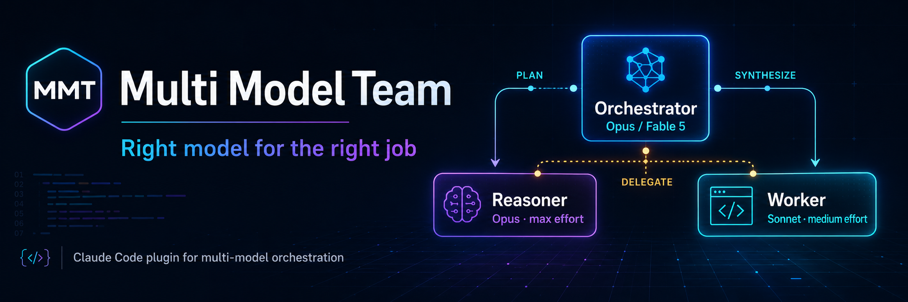

# Multi Model Team (MMT)

<sub>plugin id: `multi-model-team`</sub>

**다른 언어로 보기: [English](README.md) · [한국어](README.ko.md)**

> 작업을 **모델들의 팀**에게 나눠 맡기는 Claude Code 플러그인 — 오케스트레이터는
> 계획과 분배만 하고, Opus 전문가가 어려운 추론을, Sonnet 워커가 기계적인 작업을
> 담당합니다. 알맞은 모델에게 알맞은 일을.

[](LICENSE)


---

## MMT란?

**MMT(Multi Model Team)** 는 하나의 세션을 모델들의 팀으로 바꾸는 Claude Code
플러그인입니다. 오케스트레이터가 계획과 분배를 맡고, Opus 에이전트가 어려운 추론을,
Sonnet 에이전트가 기계적인 작업을 담당합니다.

이런 구조가 필요한 이유: 모델 하나가 모든 작업을 처리하면 어딘가에서 손해를 봅니다.
최상위 모델이 단순한 보일러플레이트에 비싼 토큰을 쓰거나, 저렴한 모델이 감당 못 할
아키텍처 결정을 내리는 식이죠. **MMT는 작업 종류마다 맞는 모델을 배정합니다.**

| 이점 | MMT가 제공하는 방식 |
|---|---|
| 💸 **같은 품질, 더 낮은 비용** | 보일러플레이트·테스트·포맷팅은 Sonnet(`worker`)이, 진짜 어려운 추론만 Opus `max` effort(`reasoner`)가 맡습니다. 단순 수정에 비싼 요금을 낼 일이 없어집니다. |
| 🧠 **어려운 문제에서 더 나은 판단** | 디버깅, 알고리즘 설계, 아키텍처 결정은 항상 max-effort Opus 전용 에이전트가 처리합니다. |
| 🎛️ **오케스트레이터는 상위 시점 유지** | 메인 세션은 **계획·분배·종합**만 맡아 컨텍스트가 깔끔하게 유지됩니다. |
| ⚡ **병렬 처리량** | 독립적인 하위 작업은 동시에 진행됩니다 (예: `reasoner`가 알고리즘을 설계하는 동안 `worker`가 테스트 뼈대를 준비). |
| 👀 **기본적으로 투명함** | 세션을 시작할 때마다 현재 팀 구성이 표시되어, 어떤 모델이 무슨 일을 맡는지 바로 알 수 있습니다. |

---

## 역할별 담당 모델

| 역할 | 모델 | 담당 |
|---|---|---|
| **오케스트레이터** (메인 세션) | **Opus 4.8** 또는 **Fable 5** — 선택 (`/orchestrator-model`) | 계획·분배·종합 **만**. 직접 구현하지 않음. |
| `reasoner` 서브에이전트 | Opus 고정 (`model: opus`, `effort: max`) | 어려운 디버깅, 알고리즘·아키텍처 설계, "왜 이렇게 동작하는가" 규명. |
| `worker` 서브에이전트 | Sonnet 고정 (`model: sonnet`, `effort: medium`) | 보일러플레이트, 테스트, 포맷팅/린트, 반복 수정, 지시가 명확한 단순 수정. |

**역할 분리 규칙**은 `orchestration-protocol` 스킬이 강제합니다. 코딩/설계/디버깅
요청에서 자동으로 트리거되어, 오케스트레이터가 직접 작업하지 않고 위임하도록 합니다.

---

## 빠른 시작

### GitHub에서 설치

Claude Code 안에서:

```
/plugin marketplace add devFallingstar/multi-model-team
/plugin install multi-model-team@multi-model-team-marketplace
/reload-plugins
```

### 로컬 클론에서 설치

```bash
git clone https://github.com/devFallingstar/multi-model-team.git
cd multi-model-team
claude
```

Claude Code 안에서 — **경로는 반드시 `./` 형식**이어야 합니다. 점 하나 `.` 는
`Invalid marketplace source format` 에러가 납니다:

```
/plugin marketplace add ./
/plugin install multi-model-team@multi-model-team-marketplace
/reload-plugins
```

또는 터미널에서 비대화형으로:

```bash
claude plugin marketplace add ./
claude plugin install multi-model-team@multi-model-team-marketplace
```

로드 확인:

```bash
claude plugin details multi-model-team@multi-model-team-marketplace
# Agents (2) reasoner, worker · Hooks (1) SessionStart · + 커맨드 & 스킬
```

---

## 사용법

### 자연어로 요청

`orchestration-protocol` 스킬이 스스로 트리거되지만, 명시적으로 위임할 수도 있습니다:

```
reasoner에게 이 레이스 컨디션의 근본 원인을 분석하게 해줘.
worker한테 이 함수들에 대한 테스트 스켈레톤 만들어달라고 해.
```

### 전체 오케스트레이션 워크플로 실행

```
/orchestrate 인벤토리 시스템에 아이템 스택 병합 로직을 추가하고 테스트까지 작성해줘.
```

내부적으로:

1. **계획** — 오케스트레이터가 요청을 `[reasoner]` / `[worker]` 하위 작업으로 분해해 보여줍니다.
2. **분배** — 독립 작업은 병렬로, 의존 작업은 순차로 위임합니다. 오케스트레이터는 직접 구현하지 않습니다.
3. **종합** — 모든 결과를 하나의 일관된 답과 다음 단계로 정리합니다.

---

## 오케스트레이터 모델 선택: Opus vs Fable 5

```
/orchestrator-model            # 비교표를 보여주고 물어봄
/orchestrator-model opus       # 상시 사용 기본값; 비용·사용량 기준선
/orchestrator-model fable      # 초장기·모호한 자율 작업 전용
```

|  | Opus 4.8 | Fable 5 |
|---|---|---|
| 성격 | 상시 사용 가능한 최상위 안정 모델 | Opus보다 상위 등급, 장시간·모호한 문제 전용 |
| 비용 | 기준 | Opus의 약 2배, 사용량 소진도 약 2배 빠름 |
| Thinking | effort로 조절 | 항상 켜짐 (끌 수 없음) |
| 적합한 경우 | 대부분의 코딩/디버깅/설계 작업 | 목표만 주면 스스로 조사·계획·검증까지 하는 장시간 자율 작업 |
| 주의 | — | 보안/생물학 관련 내용 감지 시 자동으로 Opus로 폴백될 수 있음 (`/model fable`로 복귀) |

선택은 프로젝트의 `.claude/settings.local.json`(`model` + `effortLevel`)에 저장되어
**다음 세션부터** 적용됩니다. 지금 세션에 즉시 적용하려면 직접 `/model opus` 또는
`/model fable`을 입력하세요.

> **effort 관련 참고:** 설정의 `effortLevel`은 `low` / `medium` / `high` / `xhigh`만
> 저장할 수 있습니다. **`max`는 저장할 수 없고 세션 안에서만 동작합니다.** 정말
> 어려운 작업에는 세션 중에 `/effort max`를 직접 입력하세요.

---

## 구성 요소

```
multi-model-team/
├── .claude-plugin/
│   ├── plugin.json          # 플러그인 메타데이터
│   └── marketplace.json     # 로컬 설치용 self-reference 마켓플레이스
├── agents/
│   ├── reasoner.md      # model: opus, effort: max
│   └── worker.md        # model: sonnet, effort: medium
├── skills/
│   └── orchestration-protocol/SKILL.md   # 역할 분리 규칙, 자동 트리거
├── commands/
│   ├── orchestrate.md        # /orchestrate <작업>
│   └── orchestrator-model.md # /orchestrator-model [opus|fable]
├── hooks/
│   ├── hooks.json            # SessionStart 훅 등록
│   └── session-start-reminder.js   # Node 스크립트 — bash/python 의존성 없음, 크로스플랫폼
├── LICENSE
└── README.md
```

SessionStart 훅은 **Node** 스크립트입니다(Claude Code에 Node가 기본 포함). 덕분에
`bash`나 `python3` 의존성 없이 Windows·macOS·Linux에서 동일하게 동작합니다.

---

## 커스터마이징 팁

- `worker`의 `effort`를 `low`로 낮추면 더 저렴/빠르게 잡일을 처리합니다. 유효
  effort 값: `low` / `medium` / `high` / `xhigh` / `max` (모델별 지원 범위 다름).
- `reasoner`에 `isolation: worktree`를 추가하면 별도 git worktree에서 안전하게
  실험하게 할 수 있습니다.
- 각 에이전트의 `tools`를 좁혀(예: 리뷰 전용 에이전트는 `Read, Grep, Glob`만) 권한을
  최소화할 수 있습니다.
- 유효한 `model` 별칭: `sonnet`, `opus`, `haiku`, `fable` (또는 전체 모델 ID, 또는 `inherit`).

---

## 라이선스

[MIT](LICENSE) © 유성
